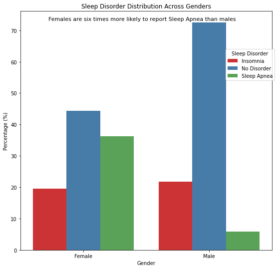
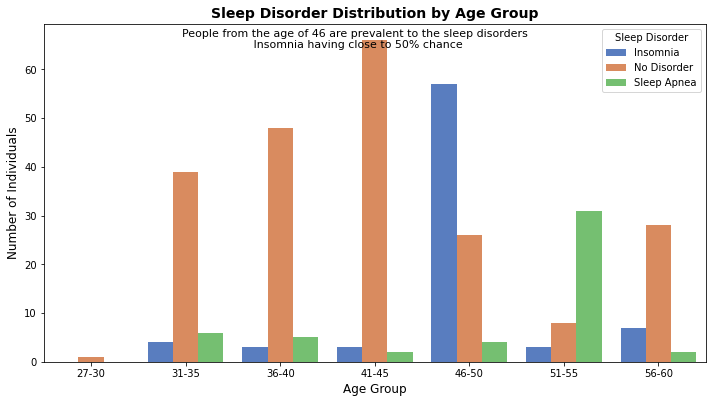
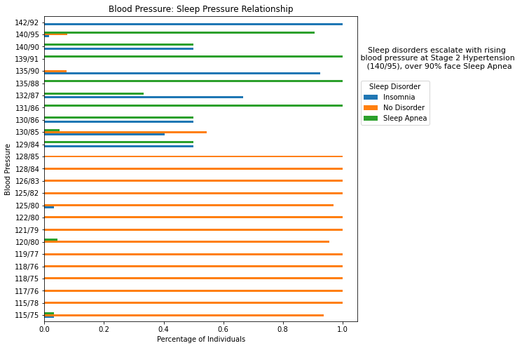
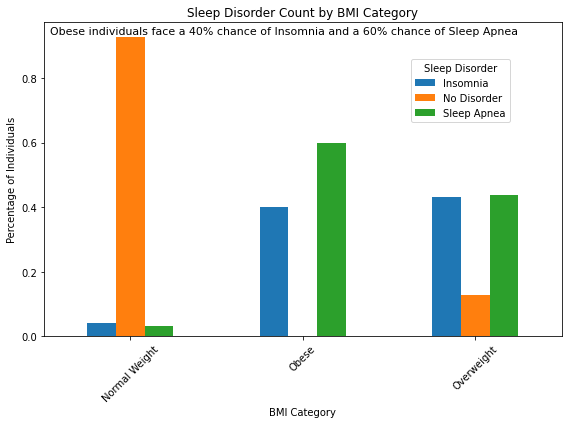
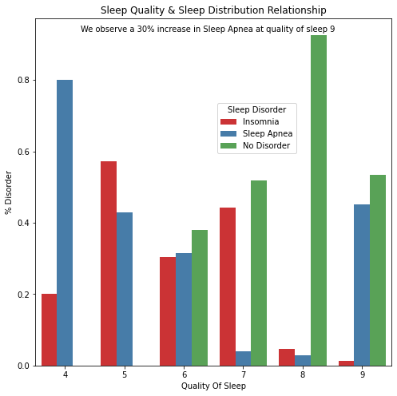

# Polate Wellness Centre: Health & Wellness

## Business Understanding
Polate Wellness Centre has observed a significant rise in patients reporting poor sleep quality, which is affecting their daily productivity and overall well-being. To proactively address this growing concern, the Centre is seeking data-driven insights into the factors associated with sleep disorders.

As part of this initiative, I have been tasked with analyzing existing sleep health data to uncover patterns, trends, and similarities among individuals who suffer from sleep disorders such as Insomnia and Sleep Apnea. 

These insights will serve as the foundation for developing effective early screening tools, designing a user-friendly app for tracking sleep patterns, and ultimately integrating predictive diagnostics into routine care, once the Centre begins collecting its own patient data.

**Why is this important?**
If your lifespan is 75 years and you sleep for 8 hours a day, you will have spent 25 years asleep that's a full one-third of your life devoted to rest.
But sleep isn’t just about time it’s about quality. Poor sleep quality or sleep disorders can turn those 25 years into fragmented restless nights that affect your health, mood and productivity.
Dive with me as we explore what truly affects sleep quality and uncover the sleep disorders such as Insomnia and Sleep Apnea that disrupt this essential part of our lives. Through data driven insights, we will understand the factors influencing sleep and how to improve this critical component of overall well-being.

##  Data Understanding
The Sleep Health and Lifestyle Dataset is found on kaggle [here](https://www.kaggle.com/datasets/uom190346a/sleep-health-and-lifestyle-dataset)
It consists of 374 rows and 13 columns. See the column names and their respective description:

**Column Name:	Description**

- Age:	Age of the individual

- Gender:	Male/Female

- Occupation:	Job type or profession

- Sleep Duration:	Hours of sleep per night

- Quality of Sleep:	Subjective rating (e.g., 1–10 scale)

- Physical Activity Level:	Exercise frequency

- Stress Level:	Self-reported stress level

- BMI Category:	Underweight, Normal, Overweight, Obese

- Blood Pressure:	Blood pressure readings

- Heart Rate:	Beats per minute

- Daily Steps:	Average number of steps per day

- Sleep Disorder:	Diagnosed sleep disorder: None, Insomnia, Sleep Apnea

- Daily Steps:	Average number of steps per day

- Sleep Disorder:	Diagnosed sleep disorder: None, Insomnia: Insomnia is difficulty falling asleep, staying asleep, or waking up too early and being unable to fall back asleep, despite having enough time and opportunity for sleep, Sleep Apnea: A sleep disorder where breathing repeatedly stops and starts during sleep.

**Data Limitations**

The data is small in size and we do not know when the data was collected. We are therefore not able to do a time based analysis for prediction.

### EDA Exploratory Data Analysis

Sleep Disorder Distribution Across Gender

**Observations**

Females are six times more likely to report Sleep Apnea than males. 

Sleep Disorder Distribution Across Age Groups

**Observations**

Individuals aged 46–50 are 20% more likely to experience Sleep Apnea compared to those aged 41–45, who are more prone to Insomnia.

Blood Pressure Sleep Disorder Relationship

**Observations**

We have a clear escalation in sleep disorders as blood pressure rises. Individuals with normal blood pressure show minimal sleep disorders, but once blood pressure enters the hypertensive range, the likelihood of Insomnia and Sleep Apnea spikes dramatically. Notably, at Stage 2 Hypertension (140/95), over 90% of individuals suffer from Sleep Apnea.

BMI Category and Sleep Disorder

**Observations**

BMI Category contributes 95% to how one sleeps individuals with a normal BMI face less than a 10% chance of experiencing any sleep disorder

Sleep Quality and Sleep Disorder Relationship

**Observations**

We observe a 30% increase in the prevalence of Sleep Apnea among individuals with a self-reported sleep quality score of 9. This suggests that even those who perceive their sleep as high-quality may still experience undiagnosed or underlying apnea symptoms, highlighting the importance of clinical sleep assessments.

### Conclusions
* Females are six times more likely to report Sleep Apnea than males. Generally males get more pre-disposed to Sleep Apnea than females however our data gives us a different analysis.

* The analysis reveals that individuals aged 46 years and above show a significantly higher prevalence of sleep disorders, particularly Insomnia, with nearly 50% of individuals in this age group experiencing difficulties with sleep initiation or maintenance. This highlights age as a key factor influencing sleep quality and overall well-being

* Our data reveals a clear escalation in sleep disorders as blood pressure rises. Individuals with normal blood pressure show minimal sleep disorders, but once blood pressure enters the hypertensive range, the likelihood of Insomnia and Sleep Apnea spikes dramatically. Notably, at Stage 2 Hypertension (140/95), over 90% of individuals suffer from Sleep Apnea.

* While sufficient sleep of up to 8 hours appears protective against Sleep Apnea, prolonged sleep beyond this duration may indicate underlying health issues or contribute to increased risk. This reinforces the importance of both sleep quality and appropriate sleep duration rather than simply maximizing sleep hours.

### Recommendations
* Investigate further to confirm whether this reflects an actual higher prevalence or a reporting/diagnostic bias.

* Implementing routine sleep assessments for patients in this age group during wellness check-ups

* Individuals should be more keen with their diet and ensure they have an active lifestlye in order to have a normal/ acceptable blood pressure. 

* Include sleep duration monitoring within the planned sleep tracking app, with personalized feedback for those exceeding or falling short of the recommended sleep window.

